# Homelab Proxmox — Infrastructure Complète

> **Projet 0 — Fondation de tous les projets lab**
> Documentation complète de la conception, installation et configuration d'une infrastructure virtualisée sur serveur physique dédié. 

---

## Table des matières

- [Introduction & Objectifs](#introduction-objectifs)
- [Matériel & Prérequis](#matériel-prérequis)
- [Architecture réseau](#architecture-réseau)
- [Installation Proxmox](#installation-proxmox)
- [Installation OPNsense](#installation-opnsense)
- [Configuration OPNsense](#configuration-opnsense)
- [Installation et Configuration Windows Server](#installation-et-configuration-windows-server)
- [Tests & Validation](#tests-validation)
- [Prochaines étapes](#prochaines-étapes)

---

## Introduction & Objectifs

### Contexte

Ce projet documente la mise en place d'une infrastructure virtualisée complète sur serveur physique dédié. L'objectif est simple : disposer d'un environnement stable et segmenté qui simule un réseau d'entreprise réel, sur lequel je peux déployer et expérimenter mes projets futurs en système, cloud et sécurité.

Chaque choix technique documenté ici a été réfléchi et appliqué comme en environnement de production.

### Objectifs

- Déployer un hyperviseur **Proxmox VE 9.1** sur serveur bare-metal
- Concevoir une **architecture réseau segmentée** en 3 zones (LAN, DMZ, WAN)
- Mettre en place un **firewall OPNsense** comme point de contrôle central du trafic
- Déployer un **Active Directory Windows Server 2019** avec DNS et DHCP


### Compétences mobilisées

`Proxmox VE` `OPNsense` `Windows Server 2019` `Active Directory` `DNS` `DHCP`
`Firewall` `Architecture réseau` `Segmentation réseau`

---


---

## Matériel & Prérequis

### Serveur physique

| Composant | Détail |
|-----------|--------|
| **Machine** | [Minisforum MS01](https://minisforumpc.fr/products/minisforum-ms-01-work-station) |
| **CPU** | Intel Core i5-12600H — 12 cœurs (4P + 8E) |
| **Réseau** | 2× RJ45 Ethernet · 2× SFP+ · 1× WiFi |


> Le Minisforum MS01 est un mini-PC compact particulièrement adapté au homelab — faible consommation électrique, silencieux, et suffisamment puissant pour faire tourner une dizaine de VMs simultanément.

---

### Logiciels & ISOs utilisés

| Logiciel | Version | Rôle |
|----------|---------|------|
| Proxmox VE | 9.1-1 | Hyperviseur |
| OPNsense | 26.1.2 | Firewall / Routeur |
| Windows Server 2019 | Datacenter Evaluation | Active Directory / DNS / DHCP |

---

### Prérequis réseau

| Élément | Détail |
|---------|--------|
| Box FAI | Réseau domestique |
| IP Proxmox | `192.168.1.X` — fixe sur la box |
| IP OPNsense WAN | `192.168.1.x` — fixe sur la box |

> Dans ce lab, l'interface WAN d'OPNsense est connectée au réseau domestique et non à internet directement. C'est une contrainte du homelab qui diffère d'une infrastructure de production où le WAN reçoit une IP publique.

---

### Connectique réseau utilisée

Le MS01 dispose de 4 interfaces réseau mais seule `nic0` (RJ45) est utilisée physiquement branchée sur la box FAI. Les bridges `vmbr1` et `vmbr2` sont des réseaux 100% internes à Proxmox sans carte physique associée.

| Interface physique | Utilisation |
|-------------------|-------------|
| `nic0` (RJ45) | Connectée à la box `vmbr0` |
| `nic1` (RJ45) | Non utilisée réservée |
| `nic2` / `nic3` (SFP+) | Non utilisées |
| `wlp89s0` (WiFi) | Disponible mais non recommandée pour un usage serveur |

> **Sur le WiFi** : L'interface WiFi est fonctionnelle mais présente des déconnexions fréquentes sous Linux en usage serveur. Elle n'est pas recommandée pour un hyperviseur en production. Conservée uniquement comme accès de secours à l'interface Proxmox.

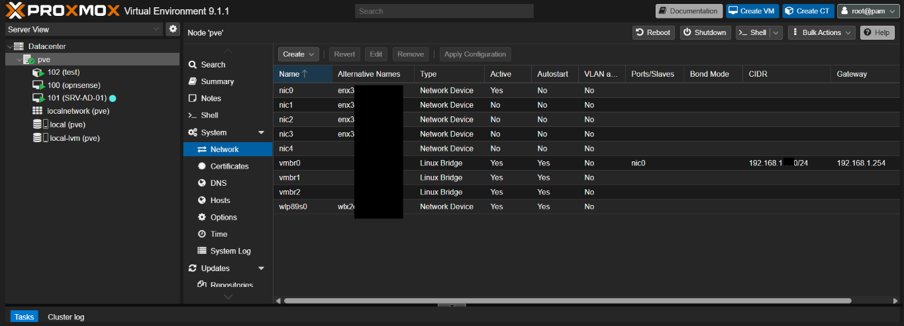

---

### Contraintes du lab vs Production

**Contrainte 1 — Le réseau domestique simule Internet**

Dans ce lab, le réseau de la box FAI joue le rôle d'Internet. L'interface WAN d'OPNsense (`192.168.1.x`) est connectée à un réseau privé et non à une IP publique réelle.


**Contrainte 2 — Blocage RFC1918 sur l'interface WAN**

OPNsense bloque par défaut tout le trafic provenant des plages d'adresses privées (RFC1918) sur l'interface WAN. Dans notre lab cette règle bloque les accès depuis le réseau domestique vers OPNsense via le WAN.

La solution retenue : l'administration d'OPNsense se fait exclusivement depuis le LAN (`https://10.10.0.1`). C'est la bonne pratique en production.

---

## Architecture réseau
 
### Vue d'ensemble
 
 
L'infrastructure est segmentée en **3 zones réseau distinctes**, chacune avec un rôle précis. Tout le trafic entre ces zones est contrôlé par OPNsense qui joue le rôle de firewall, routeur et résolveur DNS central.
 
---
 
### Les 3 zones réseau
 
| Zone | Bridge Proxmox | Plage IP | Rôle |
|------|---------------|----------|------|
| WAN | `vmbr0` | `192.168.1.x` | Connexion vers la box FAI Internet simulé |
| LAN | `vmbr1` | `10.10.0.x/24` | Infrastructure interne serveurs, AD, BDD |
| DMZ | `vmbr2` | `10.20.0.x/24` | Services exposés reverse proxy |
 
---
 
### Composants et adressage
 
| Composant | Zone | IP | Rôle |
|-----------|------|----|------|
| OPNsense WAN | WAN | `192.168.1.x` | Interface externe du firewall |
| OPNsense LAN | LAN | `10.10.0.1` | Gateway + DNS réseau LAN |
| OPNsense DMZ | DMZ | `10.20.0.1` | Gateway + DNS réseau DMZ |
| Windows Server | LAN | `10.10.0.10` | AD DS · DNS · DHCP · `securlab.internal` |
| Nginx (futur) | DMZ | `10.20.0.10` | Reverse proxy |
 
---
 
### Politique de sécurité réseau
 
Les règles firewall OPNsense implémentent le principe du **moindre privilège** seuls les flux nécessaires sont autorisés.
 
| Source | Destination | Règle | Justification |
|--------|-------------|-------|---------------|
| LAN | Internet | Autorisé | Mises à jour et services |
| DMZ | Internet | Autorisé | Services DMZ |
| LAN | DMZ | Bloqué | Isolation des zones |
| DMZ | LAN | Bloqué par défaut | Exception : Nginx → app backend port applicatif uniquement |
| Internet | DMZ port 80/443 | Autorisé (futur) | Accès public au reverse proxy |
| Internet | DMZ autre | Bloqué | Aucune autre exposition |
 
---
 
### Fonctionnement du DNS
 
Toutes les VMs pointent vers OPNsense comme résolveur DNS  pas directement vers Windows Server.
 
 
> Ce choix centralise la résolution DNS sur OPNsense. Si Windows Server change d'IP, on modifie uniquement le Query Forwarding dans OPNsense — pas la configuration de toutes les VMs.
 
 
---
 
### Pourquoi ces choix techniques ?
 
**Pourquoi OPNsense ?**
OPNsense est activement maintenu, dispose de WireGuard natif pour le futur projet hybride Azure et intègre Suricata nativement pour l'IDS/IPS.
 
**Pourquoi Windows Server dans le LAN ?**
L'Active Directory est le cœur de l'infrastructure. Le placer dans la DMZ l'exposerait inutilement — il doit rester dans la zone la plus protégée.
 
**Pourquoi séparer LAN et DMZ ?**
Si un serveur LAN est compromis, l'attaquant ne peut pas atteindre les services exposés en DMZ. Si un service DMZ est compromis, l'attaquant ne peut pas latéraliser vers le LAN.
 

 ---
 
## Installation Proxmox
 
### Téléchargement et installation
 
ISO officielle et guide de démarrage : [Proxmox VE — Get Started](https://www.proxmox.com/en/products/proxmox-virtual-environment/get-started)
 
---
 
 
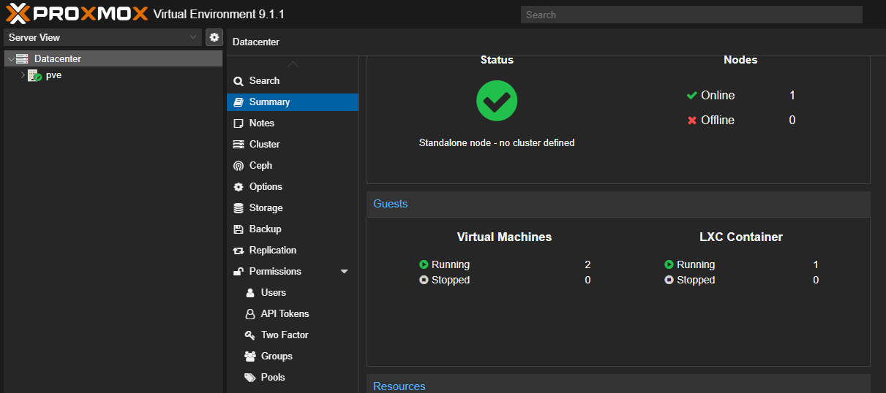
 
---
 
### Post-installation
 
Après l'installation, deux actions sont nécessaires avant toute configuration.
 
**1. Désactiver le dépôt Enterprise et activer le dépôt Community**
 
Par défaut Proxmox configure le dépôt Enterprise qui nécessite une licence payante. Sans licence les mises à jour échouent. On bascule sur le dépôt community gratuit :
 
```bash
# Désactiver le repo enterprise
echo "# Disabled" > /etc/apt/sources.list.d/pve-enterprise.list
 
# Ajouter le repo community
echo "deb http://download.proxmox.com/debian/pve bookworm pve-no-subscription" \
  > /etc/apt/sources.list.d/pve-no-subscription.list
 
# Mettre à jour
apt update && apt full-upgrade -y
```
 
Il est possible de Supprimer le popup de souscription**
 
 
> les étapes peuvent aussi être réalisées via le script communautaire **Proxmox VE Helper Scripts** de tteck :
> `bash -c "$(curl -fsSL https://raw.githubusercontent.com/tteck/Proxmox/main/misc/post-pve-install.sh)"`
 
---
 
### Configuration des bridges réseau
 
Les bridges sont des switches virtuels gérés par Proxmox. Ils permettent aux VMs de communiquer entre elles et avec l'extérieur sans nécessiter de matériel physique supplémentaire.

 

 
---
 
### Sécurisation de l'accès Proxmox
 
**1. Créer un utilisateur admin dédié**
 
Ne jamais utiliser `root` au quotidien.
 
`Datacenter` → `Permissions` → `Users` → **Add**
 
| Champ | Valeur |
|-------|--------|
| Username | `admin` |
| Realm | `pve` |
| Role | `Administrator` sur `/` |
 
**2. Activer le 2FA (TOTP)**
 
`Datacenter` → `Permissions` → `Two Factor` → **Add** → **TOTP**
 
Scanner le QR code avec Google Authenticator ou Authy. Le code à 6 chiffres est requis à chaque connexion.
 
> Le 2FA est activé avant de désactiver root pour ne jamais se retrouver bloqué hors de l'interface.
 
**3. Créer l'utilisateur Linux et sécuriser SSH**
 
L'utilisateur Proxmox (`admin@pve`) n'existe pas automatiquement au niveau Linux. On le crée manuellement :
 
```bash
# Installer sudo — absent par défaut sur Proxmox
apt install sudo -y
 
# Créer l'utilisateur Linux
useradd -m -s /bin/bash admin
passwd admin
 
# Ajouter au groupe sudo
usermod -aG sudo admin
```
 
**4. Sécuriser SSH**
 
Deux modifications uniquement dans `/etc/ssh/sshd_config` :
 
```bash
# Désactiver le login root direct
PermitRootLogin no
 
# Autoriser uniquement l'utilisateur admin
AllowUsers admin
```
 
> **Pourquoi ne pas changer le port SSH sur Proxmox ?** Proxmox utilise SSH en interne pour la migration de VMs, le clustering et les outils `qm` et `pct`. Changer le port casserait ces fonctionnalités internes.
 
```bash
# Appliquer les changements
systemctl restart sshd
```
 

 
---
## Installation OPNsense
 
OPNsense est la première VM à créer et configurer toutes les autres VMs dépendent de lui pour accéder à internet, au DNS et au routage entre les zones.
 
---
 
### Téléchargement de l'ISO
 
ISO officielle : [https://opnsense.org/download/](https://opnsense.org/download/)
 
| Paramètre | Valeur |
|-----------|--------|
| Architecture | `amd64` |
| Image type | `dvd` |
| Version utilisée | `OPNsense-26.1.2-dvd-amd64.iso` |
| Taille | 2.21 Go |
 
> Le fichier téléchargé est au format `.bz2`. Il faut le décompresser avant l'upload sur Proxmox. Sous Windows : clic droit → winrar → Extract here.
 
**Upload sur Proxmox :**
`Node pve` → `local` → `ISO Images` → **Upload**
 
---
 
### Création de la VM
 
`Create VM` en haut à droite de l'interface Proxmox.
 
**Onglet General**
 
| Paramètre | Valeur |
|-----------|--------|
| VM ID | `100` |
| Name | `opnsense-fw` |
 
**Onglet OS**
 
| Paramètre | Valeur |
|-----------|--------|
| ISO Image | `OPNsense-26.1.2-dvd-amd64.iso` |
| Type | `Other` |
 
**Onglet System**
 
| Paramètre | Valeur | Justification |
|-----------|--------|---------------|
| BIOS | `SeaBIOS` | OVMF (UEFI) incompatible avec l'ISO OPNsense 26.x la VM tente de booter par PXE au lieu de l'ISO |
| Machine | `pc-i440fx` | Compatibilité optimale avec OPNsense sous KVM |
 
**Onglet Disks**
 
| Paramètre | Valeur | Justification |
|-----------|--------|---------------|
| Storage | `local-lvm` | Pool LVM-Thin Proxmox |
| Disk size | `20 Go` | Suffisant  OPNsense stocke uniquement sa config et ses logs |
| Cache | `Write back` | Améliore les performances I/O d'environ 30% |
 
**Onglet CPU**
 
| Paramètre | Valeur | Justification |
|-----------|--------|---------------|
| Cores | `2` | Suffisant pour un firewall lab |
| Type | `host` | Expose les vraies instructions du CPU — active AES-NI pour le chiffrement VPN |
 
> **Pourquoi CPU type `host` ?** Le type `kvm64` par défaut masque les instructions natives du processeur. Le type `host` expose directement les instructions de l'Intel i5-12600H  notamment **AES-NI** qui accélère significativement le chiffrement WireGuard et OpenVPN.
 
**Onglet Memory**
 
| Paramètre | Valeur |
|-----------|--------|
| Memory | `2048 Mo` |
 
**Onglet Network**
 
| Paramètre | Valeur |
|-----------|--------|
| Bridge | `vmbr0` |
| Model | `VirtIO` |
 
> Ne pas démarrer la VM immédiatement il faut d'abord ajouter les 2 interfaces réseau manquantes.
 

 
---
 
### Ajout des interfaces réseau LAN et DMZ
 
Après la création de la VM, aller dans `Hardware` → `Add` → `Network Device`.
 
**Interface LAN — vmbr1**
 
| Paramètre | Valeur |
|-----------|--------|
| Bridge | `vmbr1` |
| Model | `VirtIO` |
 
**Interface DMZ — vmbr2**
 
| Paramètre | Valeur |
|-----------|--------|
| Bridge | `vmbr2` |
| Model | `VirtIO` |
 
La VM doit avoir exactement 3 interfaces réseau :
 
| Interface VM | Bridge | Rôle |
|-------------|--------|------|
| `net0` (vtnet0) | `vmbr0` | WAN → box FAI |
| `net1` (vtnet1) | `vmbr1` | LAN → 10.10.0.1/24 |
| `net2` (vtnet2) | `vmbr2` | DMZ → 10.20.0.1/24 |
 
---
 
### Installation depuis l'ISO
 
Démarrer la VM et ouvrir la console noVNC.
 
**Problème rencontré boot PXE au lieu de l'ISO**
 
Lors du premier test avec BIOS `OVMF (UEFI)`, la VM tentait de booter par le réseau (PXE) au lieu de l'ISO. Erreurs affichées :
```
BdsDxe: failed to load Boot0003 "UEFI QEMU HARDDISK"
BdsDxe: loading Boot0002 "UEFI QEMU DVD-ROM"
BdsDxe: failed to load Boot0002 : Access Denied
```
 
**Solution** : changer le BIOS de `OVMF` vers `SeaBIOS` dans les paramètres Hardware de la VM.
 
---
 
**Écran de login — démarrage depuis l'ISO**
 
```
login    : installer
password : opnsense
```
 
**Étape 1 — Sélection du clavier**
 
Choisir `French` pour un clavier AZERTY.
 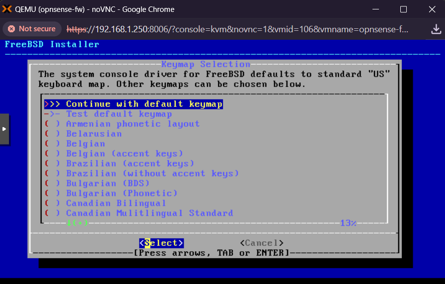

**Étape 2 — Menu d'installation**
 
Sélectionner `Install (UFS)`.

 

 Par contre, il est nécessaire de faire un partitionnement avant : assisté ou manuel.

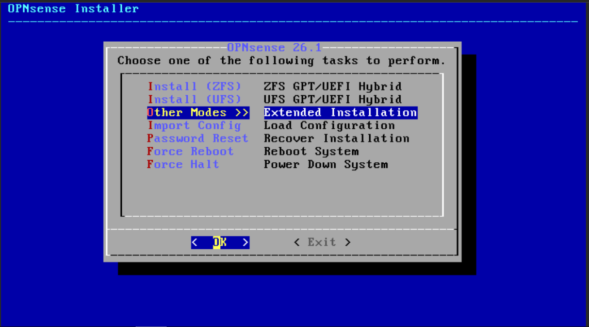

Utilisez le mode MBR en premier, puis terminez l'installation.  
Si OPNsense ne démarre pas, revenez à cette étape et choisissez un autre mode de partitionnement.essaye le GPT qui va essayer de creer une petite partition boot 
 
> **Pourquoi UFS et non ZFS ?** ZFS est recommandé pour les serveurs de stockage avec plusieurs disques  RAID, snapshots, déduplication. Pour un firewall qui stocke uniquement sa configuration et ses logs, UFS est largement suffisant et plus léger.
 
**Étape 3 — Avertissement RAM**
L'installeur affiche :
```
The installer detected only 2048MB of RAM.
Requires at least 3000MB for good operation.
```
 
Cliquer `Proceed anyway` — OPNsense fonctionne parfaitement avec 2 Go pour un usage lab non intensif.
 
**Étape 4 — Sélection du disque**
 
Sélectionner `ada0  QEMU HARDDISK (20GB)`.
 
> Attention à ne pas sélectionner `cd0` qui est l'ISO.
 
**Étape 5 — Confirmation**
 
Confirmer l'effacement du disque — `YES`.
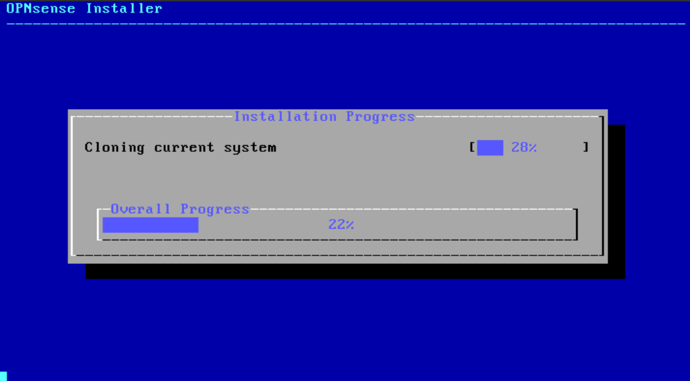
 
**Étape 6 — Mot de passe root**
 
Définir un mot de passe fort pour le compte root.
 
L'installation dure environ 2 à 3 minutes. Le système redémarre automatiquement.
 
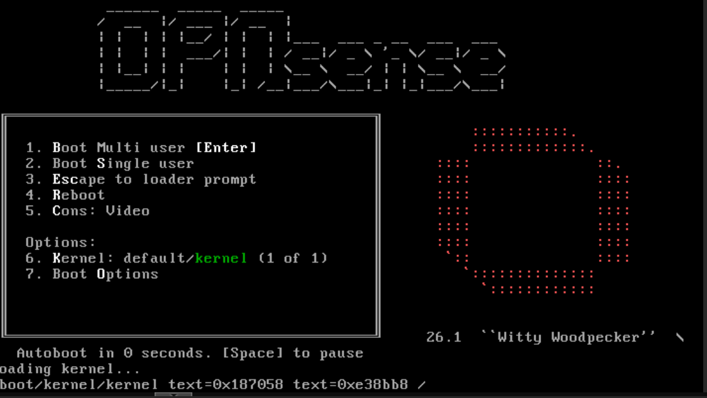
 
---
 
### Premier démarrage
 
Après le redémarrage, OPNsense détecte et assigne les interfaces automatiquement. Vérifier dans la console que les 3 interfaces sont bien configurées :

Si les interfaces ne sont pas correctement configurées, utilisez l’option 1 et suivez les instructions.
```
LAN (vtnet1)  →  v4: 10.10.0.1/24
DMZ (vtnet2)  →  v4: 10.20.0.1/24
WAN (vtnet0)  →  v4/DHCP: 192.168.1.x/24
```
 
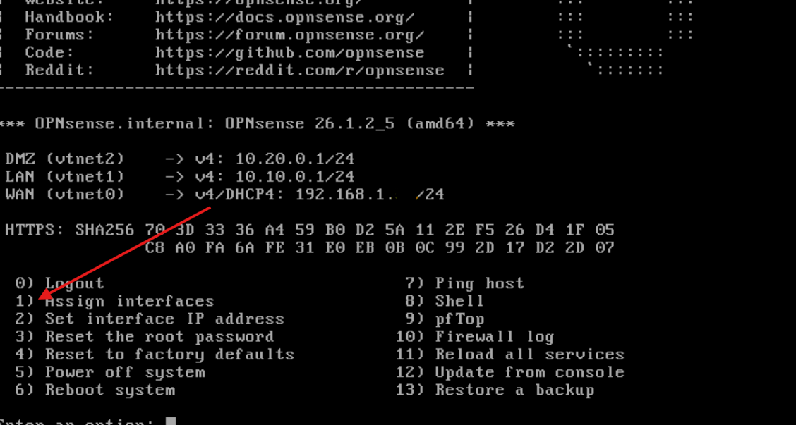
 
---
 
### Accès à l'interface web
Par défaut, tout accès est autorisé depuis le réseau LAN.  
Cependant, n’ayant pas encore la possibilité d’aller dans le réseau 10, désactivez temporairement le firewall pour accéder via le WAN, ou configurez une interface bridge depuis l’interface du routeur.

Mon objectif étant de simuler un réseau d’entreprise, je conserve donc cette configuration.


L'interface web est accessible depuis une VM du réseau LAN :
 
```
URL      : https://10.10.0.1 ou https://192.168.1.x
Login    : root
Password : opnsense  (à changer immédiatement)
```
 
> L'accès depuis le réseau domestique via le WAN est bloqué par la règle RFC1918 d'OPNsense comportement documenté en Section 2. L'administration se fait exclusivement depuis le LAN.
 
> **Contournement temporaire** : si aucune VM n'est encore disponible dans le LAN, il est possible de désactiver temporairement le firewall depuis la console OPNsense avec la commande `pfctl -d`. Cela permet d'accéder à l'interface via `https://192.168.1.x` depuis le réseau domestique. À réactiver immédiatement après configuration avec `pfctl -e`.
 


 
---
 
## Configuration OPNsense
 
### Accès à l'interface web
 
Après l'installation, l'interface web est accessible depuis une VM du réseau LAN :
 
```
URL      : https://10.10.0.1
Login    : admin
Password : opnsense  (à changer immédiatement)
```
 
> L'accès depuis le réseau domestique via le WAN est bloqué par la règle RFC1918 d'OPNsense. L'administration se fait exclusivement depuis le LAN  bonne pratique en production.
 
> **Contournement temporaire** si aucune VM n'est encore disponible dans le LAN : désactiver temporairement le firewall depuis la console OPNsense avec `pfctl -d`. Réactiver immédiatement après avec `pfctl -e`.
 
---
 
### Configuration DNS — Unbound
 
`Services` → `Unbound DNS` → `General`
 
| Paramètre | Valeur | Justification |
|-----------|--------|---------------|
| Enable Unbound | Activé | Résolveur DNS central |
| Listen Port | `53` | Port DNS standard |
| Network Interfaces | `LAN` + `DMZ`  | WAN exclu  le DNS interne ne doit jamais être accessible depuis internet |
| DHCP Domain Override | `securlab.internal` | Domaine interne du lab |
| Register ISC DHCP Leases | Activé | Enregistrement automatique des baux DHCP dans le DNS |

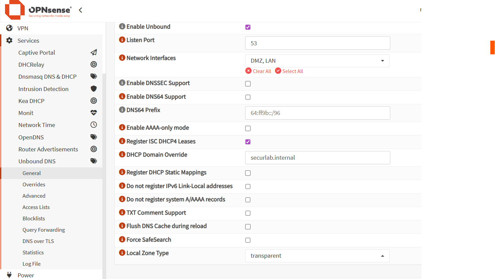
 
 
**Query Forwarding** — `Services` → `Unbound DNS` → `Query Forwarding`
 
| Domaine | Serveur | Port |
|---------|---------|------|
| `securlab.internal` | `10.10.0.10` | `53` |
 
> Toute requête pour `*.securlab.internal` est redirigée vers Windows Server. Les domaines publics sont résolus directement via les serveurs DNS configurés dans `System` → `Settings` → `General`.
 
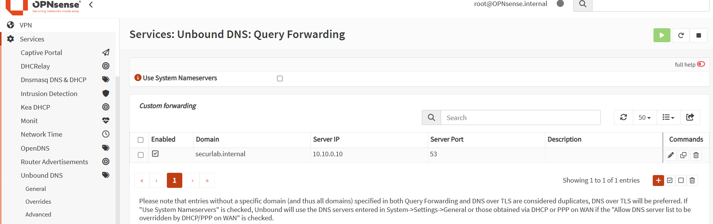
 
---
 
### Configuration DNS système
 
`System` → `Settings` → `General`
 
| Paramètre | Valeur | Justification |
|-----------|--------|---------------|
| DNS Server 1 | `8.8.8.8` | Résolution domaines publics |
| DNS Server 2 | `8.8.4.4` | Serveur de secours |
| DNS search domain | `domaine.internal` | Résolution des noms courts |
| Allow DNS override | Désactivé | Empêche le FAI de remplacer nos DNS via DHCP WAN |
 
> `Allow DNS override` désactivé est une bonne pratique. certains FAI redirigent les requêtes DNS vers des pages publicitaires ou effectuent de la surveillance.
 
---
 
### NAT sortant
 
`Firewall` → `NAT` → `Outbound`
 
Le mode **Automatic** est conservé. OPNsense génère automatiquement les règles NAT pour LAN et DMZ vers le WAN.
 
| Interface | Réseaux source | Action |
|-----------|---------------|--------|
| WAN | LAN networks, DMZ networks | Masquerade |
 
Toutes les VMs accèdent à internet via l'IP WAN d'OPNsense (`192.168.1.x`).
 
 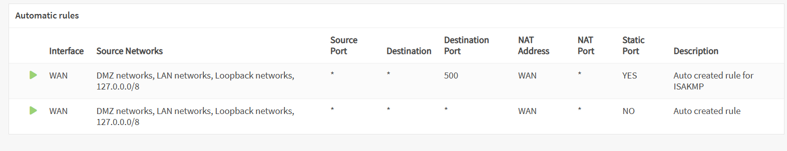
 
---
 
### Règles Firewall — Automatisées via Ansible
 
Les règles firewall sont gérées via un playbook Ansible voir le dossier `ansible/` du dépôt.
 
```bash
cd ansible/
ansible-playbook -i inventory/hosts.yml opnsense-firewall.yml
```
 
OPNsense identifie ces règles comme provenant de l'automatisation (**Rules from Automation**) — elles sont distinctes des règles manuelles.
 
**Interface LAN**
 
| Priorité | Action | Source | Destination | Justification |
|----------|--------|--------|-------------|---------------|
| 1 | Block | LAN net | `10.20.0.0/24` (DMZ) | Isolation LAN → DMZ |
| 2 | Block | LAN net | `10.30.0.0/24` (MGMT futur) | Isolation LAN → MGMT |
| 3 | Pass | LAN net | any | Accès internet |
 
**Interface DMZ**
 
| Priorité | Action | Source | Destination | Justification |
|----------|--------|--------|-------------|---------------|
| 1 | Block | DMZ net | `10.10.0.0/24` (LAN) | Isolation DMZ → LAN |
| 2 | Block | DMZ net | `10.30.0.0/24` (MGMT futur) | Isolation DMZ → MGMT |
| 3 | Pass | DMZ net | any | Accès internet |
 
> L'ordre est critique — les règles Block doivent être au-dessus des règles Pass. OPNsense évalue de haut en bas, première correspondance gagne.
 
 
### Teste de connexion 

## LAN vers DMZ 
 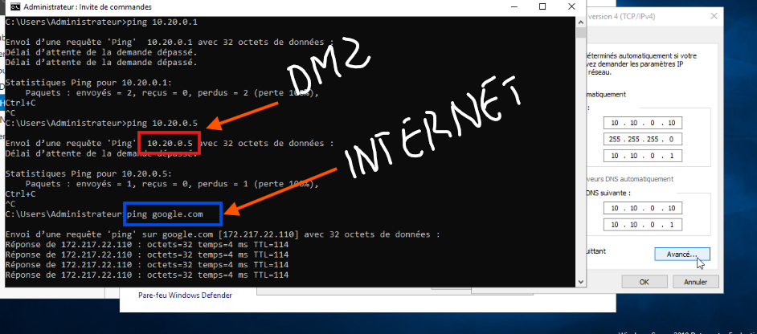

## DMZ vers LAN

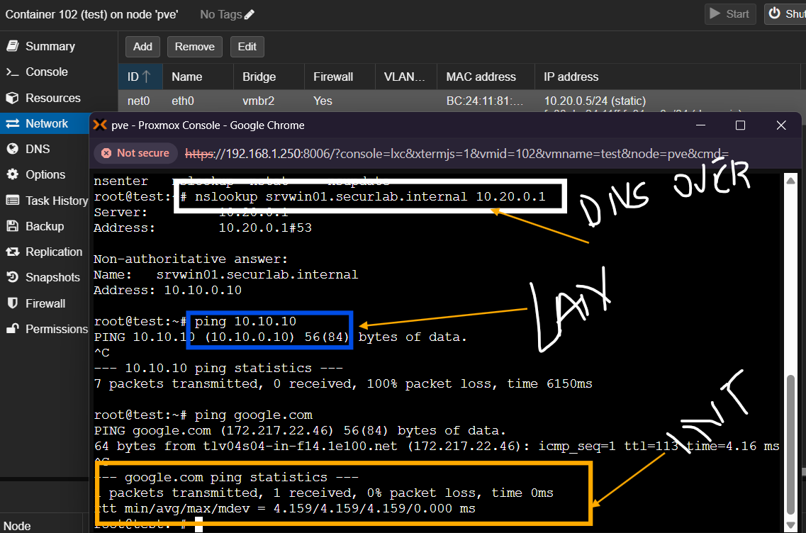