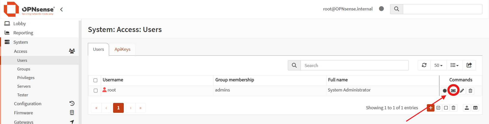

# Ansible — Configuration OPNsense

Configuration post-installation OPNsense via API REST.

## Prérequis
```bash
pip install httpx
ansible-galaxy collection install oxlorg.opnsense
```

## Credentials API

Dans OPNsense :
```
System → Access → Users → admin → Edit
→ API keys → + Ajouter
→ Télécharger le fichier .txt
```

## Configuration
```bash
cp group_vars/all.yml.example group_vars/all.yml
nano group_vars/all.yml  # remplir avec vos valeurs
```

## Usage
```bash
# Tester sans appliquer
ansible-playbook -i inventory/hosts.yml opnsense-setup.yml --check -D

# Appliquer
ansible-playbook -i inventory/hosts.yml opnsense-setup.yml

# DNS uniquement
ansible-playbook -i inventory/hosts.yml opnsense-setup.yml --tags dns

# Firewall uniquement
ansible-playbook -i inventory/hosts.yml opnsense-setup.yml --tags firewall
```

## Note importante

L'assignation des interfaces (vtnet0→WAN, vtnet1→LAN, vtnet2→OPT1) n'est pas disponible via l'API OPNsense — cette étape reste manuelle via la console.